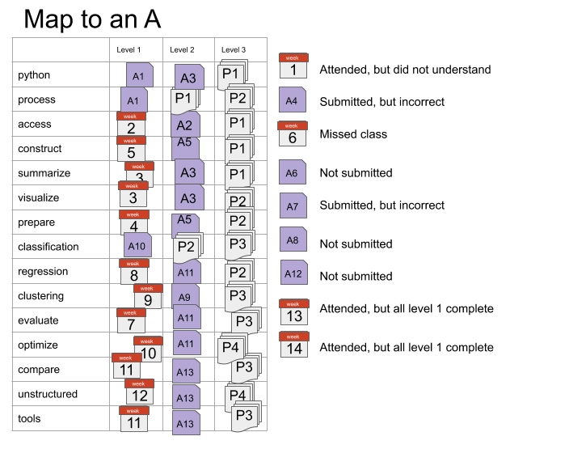
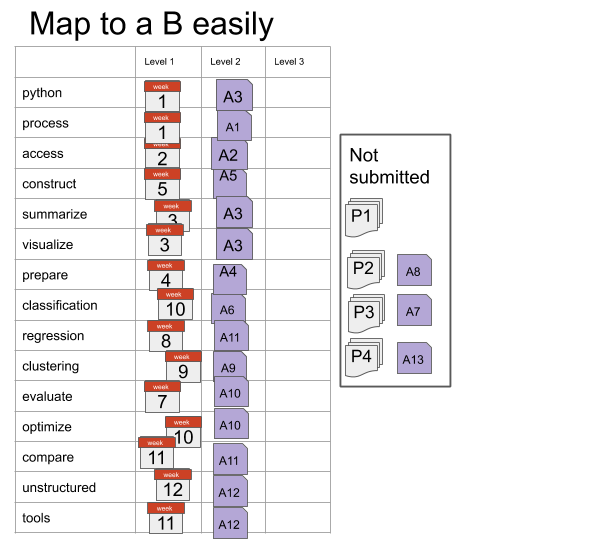
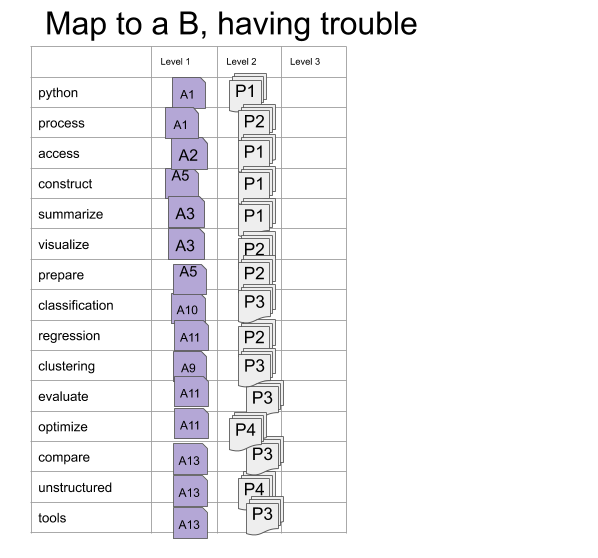

---
jupytext:
  text_representation:
    extension: .md
    format_name: myst
    format_version: 0.12
    jupytext_version: 1.6.0
kernelspec:
  display_name: Python 3
  language: python
  name: python3
---

## Grading

This section of the syllabus describes the principles and mechanics of the grading for the course.
This course will be graded on a basis of a set of *skills* (described in detail the next section of the syllabus). This is in contrast to more common grading on a basis of points earned through assignments.

+++

### Principles of Grading

Learning happens through practice and feedback. My goal as a teacher is for you to learn. The grading in this course is based on your learning of the material, rather than your completion of the activities that are assigned.


This course is designed to encourage you to work steadily at learning the material and demonstrating your new knowledge. There are no single points of failure, where you lose points that cannot be recovered. Also, you cannot cram anything one time and then forget it. The material will build and you have to demonstrate that you retained things.

- Earning a C in this class is intended to be easier than typical grading. I expect everyone to get at least a C.
<!-- , which means you have a general understanding of Data Science and could have an educated conversation about all of the topics we cover. -->
- Earning a B in this class is intended to be very accessible, you can make a lot of mistakes along the way as you learn, as long as you learn by the end.
<!-- Earning a B means that you could solve simple data science problems on your own and complete parts of more complex problems as instructed by, for example, a supervisor in an internship or entry level job.  -->
- Earning an A in this class will be challenging, but is possible even with making mistakes while you learn.
<!-- Earning an A means that you could solve moderately complex problems independently and discus the quality of others' data science solutions.  -->


Grading this way also is more amenable to the fact that there are correct and incorrect ways to do things, but there is not always a single correct answer to a realistic data science problem. Your work will be assessed on whether or not it demonstrates your learning of the targeted skills. You will also receive feedback on how to improve.

+++

### How it works

There are 15 skills that you will be graded on in this course.
While learning these skills, you will work through a progression of learning.
Your grade will be based on earning 45 achievements that are organized into 15 skill groups with 3 levels for each.

These map onto letter grades roughly as follows:
  - If you achieve level 1 in all of the skills, you will earn at least a C in the course.
  - To earn a B, you must earn all of the level 1 and level 2 achievements.
  - To earn an A, you must earn all of the achievements.

You will have at least three opportunities to earn every level 2 achievement.
You will have at least two opportunities to earn every level 3 achievement.
You will have three *types* of opportunities to demonstrate your current skill level: participation, assignments, and a portfolio.


Each level of achievement corresponds to a phase in your learning of the skill:
  - To earn level 1 achievements, you will need to demonstrate basic awareness of the required concepts and know approximately what to do, but you may need specific instructions of which things to do or to look up examples to modify every step of the way. You can earn level 1 achievements in class, assignments, or portfolio submissions.
  - To earn level 2 achievements you will need to demonstrate understanding of the concepts and the ability to apply them with instruction after earning the level 1 achievement for that skill. You can earn level 2 achievements in assignments or portfolio submissions.
  - To earn level 3 achievements you will be required to consistently execute each skill and demonstrate deep understanding of the course material, after achieving level 2 in that skill. You can earn level 3 achievements only through your portfolio submissions.


#### Participation

While attending synchronous class sessions, there will be understanding checks and in class exercises.
Completing in class exercises and correctly answering questions in class can earn level 1 achievements.
In class questions will be administered through the classroom chat platform Prismia.chat; these records will be used to update your skill progression.

#### Assignments

For your learning to progress and earn level 2 achievements, you must practice with the skills outside of class time.

Assignments will each evaluate certain skills. After your assignment is reviewed, you will get qualitative feedback on your work, and an assessment of your demonstration of the targeted skills.

#### Portfolio Checks

To earn level 3 achievements, you will build a portfolio consisting of reflections, challenge problems, and longer analyses over the course of the semester.
You will submit your portfolio for review 4 times.
The first two will cover the skills taught up until 1 week before the submission deadline.
<!-- The first portfolio check will cover skills FIXME.
The second portfolio check will cover skills FIXME. -->
The third and fourth portfolio checks will cover all of the skills.
The fourth will be due during finals. This means that, if you have achieved mastery of all of the skills by the 3rd portfolio check, you do not need to submit the fourth one.

Portfolio prompts will be given throughout the class, some will be strucutred questions, others may be questions that arise in class, for which there is not time to answer.

#### TLDR

You *could* earn a C through in class participation alone, if you make nearly zero mistakes. To earn a B, you must complete assignments and participate in class. To earn an A you must participate, complete assignments, and build a portfolio.

+++

### Detailed mechanics

On Brightspace there are 45 Grade items that you will get a 0 or a 1 grade for. These will be revealed, so that you can view them as you have an opportunity to demonstrate each one.
The table below shows the minimum number of skills at each level to earn each letter grade.  

```{code-cell} ipython3
:tags: [remove-input]

import pandas as pd
import numpy as np
N = 15
Nmaj = 10
Nmin = 5

grades = np.asarray(['A', 'A-','B+', 'B','B-', 'C+', 'C', 'C-', 'D+', 'D' ])
skill_levels_cum = [[N, N,N],[Nmaj,N,N], [Nmin,N, N],
                [0,N, N],[0,Nmaj,N], [ 0,Nmin,N]
               , [0, 0,N],[0,0,Nmaj], [ 0, 0,Nmin],
               [0,0,3]]

grade_df = pd.DataFrame(data = skill_levels_cum,
                        columns = ['Level 3','Level 2', 'Level 1'] )


grade_df['letter grade'] = grades
grade_df.set_index('letter grade')
```

````{margin}
```{note}
In this example, you will have also achieved level 1 on all of the skills, because it is a prerequisite to level 2.
```
````
For example, if you achieve level 2 on all of the skills and level 3 on 7 skills, that will be a B+.


If you achieve level 3 on 14 of the skills, but only level 1 on one of the skills, that will be a B-, because the minimum number of level 2 achievements for a B is 15.


+++

### Late work

````{margin}
```{note}
You may visit office hours to discuss assignments that you did not complete on time to get feedback and check your own understanding, but they will not count toward skill demonstration.
```
````
No late work will be graded.
Every skill will be assessed through more than one assignment, so missing assignments occasionally *may* not hurt your grade. If you do not submit any assignments that cover a given skill, you may earn the level 2 achievement in that skill through a portfolio check, but you will not be able to earn the level 3 achievement in that skill.


### Examples

```{important}
The following will make more sense after you read the next section of the syllabus and see the skills rubric sections.
```

If you always attend and get everything correct, you will earn and A and you won't need to submit the 4th portfolio check or assignment 13.

#### Getting A Without Perfection




In this example the student made several mistakes, but still earned an A. This is the advantage to this grading scheme.
For the `python`, `process`, and `classification` skills, the level 1 achievements were earned on assignments, not in class.
For the `process` and `classification` skills, the level 2 achievements were not earned on assignments, only on portfolio checks, but they were earned on the first portfolio of those skills, so the level 3 achievements were earned on the second portfolio check for that skill.
This student's fourth portfolio only demonstrated two skills: `optimize` and `unstructured`. It included only 1 analysis, a text analysis with optimizing the parameters of the model.
Assignments 4 and 7 were both submitted, but didn't earn any achievements, the student got feedback though, that they were able to apply in later assignments to earn the achievements.
The student missed class week 6 and chose to not submit assignment 6 and use week 7 to catch up.
The student had too much work in another class and chose to skip assignment 8.
The student tried assignment 12, but didn't finish it on time, so it was not graded, but the student visited office hours to understand and be sure to earn the level 2 `unstructured` achievement on assignment 13.


#### Getting a B with minimal work



In this example, the student earned all level 1 achievements in class and all level 2 on assignments.
This student was content with getting a B and chose to not submit a portfolio.

#### Getting a B while having trouble



In this example, the student struggled to understand in class and on assignments. Assignments were submitted that showed some understanding, but all had some serious mistakes, so only level 1 achievements were earned from assignments.
The student wanted to get a B and worked hard to get the level 2 achievements on the portfolio checks.
